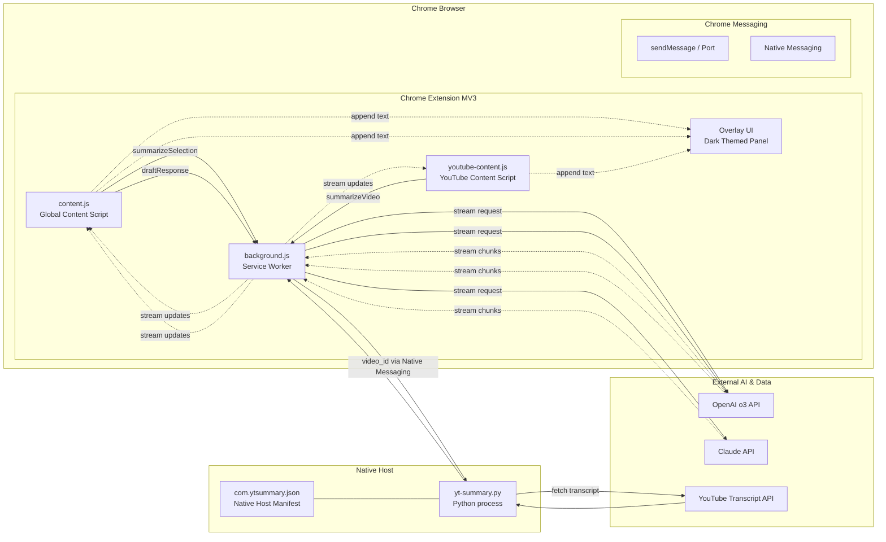

## Architecture Overview

Legend: dotted arrows indicate streaming updates

- content.js shows FABs, sends messages, and renders streaming results safely via textContent.
- youtube-content.js detects video pages and initiates transcript summarization.
- background.js orchestrates API calls (OpenAI o3, Claude) and native messaging to yt-summary.py.
- yt-summary.py fetches transcripts with youtube-transcript-api and returns JSON over the native messaging protocol.
