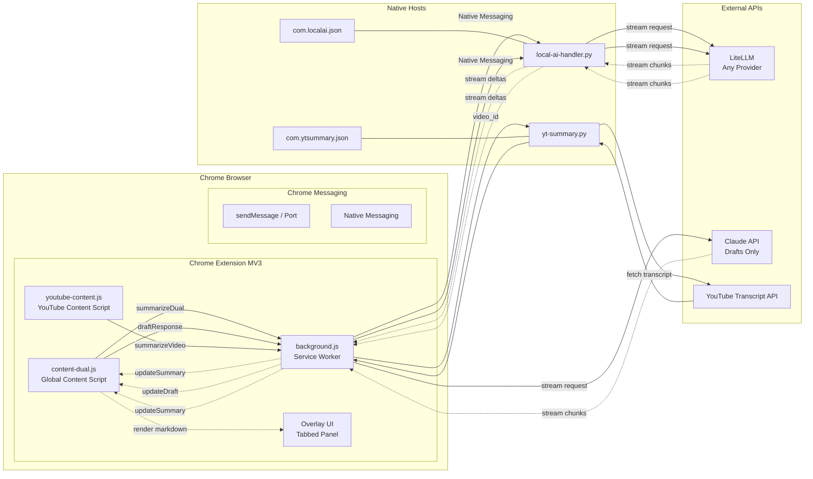

## Architecture Overview

Legend: dotted arrows indicate streaming updates


```mermaid
flowchart LR
  %% Subgraphs for clarity
  subgraph Browser[Chrome Browser]
    subgraph Extension[Chrome Extension MV3]
      CJS[content-dual.js<br/>Global Content Script]
      YTJS[youtube-content.js<br/>YouTube Content Script]
      BG[background.js<br/>Service Worker]
      UI[Overlay UI<br/>Tabbed Panel]
    end
    subgraph Messaging[Chrome Messaging]
      MSG[sendMessage / Port]
      NM[Native Messaging]
    end
  end

  subgraph NativeHosts[Native Hosts]
    YTMAN[com.ytsummary.json]
    YTPY[yt-summary.py]
    AIMAN[com.localai.json]
    AIPY[local-ai-handler.py]
  end

  subgraph APIs[External APIs]
    LITELLM[LiteLLM<br/>Any Provider]
    CLAUDE[Claude API<br/>Drafts Only]
    YTAPI[YouTube Transcript API]
  end

  %% Selected Text: Summarize
  CJS -->|summarizeDual| BG
  BG -->|Native Messaging| AIPY
  AIMAN --- AIPY
  AIPY -->|stream request| LITELLM
  LITELLM -.->|stream chunks| AIPY
  AIPY -.->|stream deltas| BG
  BG -.->|updateSummary| CJS
  CJS -.->|render markdown| UI

  %% Draft Response
  CJS -->|draftResponse| BG
  BG -->|stream request| CLAUDE
  CLAUDE -.->|stream chunks| BG
  BG -.->|updateDraft| CJS

  %% YouTube Transcript Summarization
  YTJS -->|summarizeVideo| BG
  BG -->|video_id| YTPY
  YTMAN --- YTPY
  YTPY -->|fetch transcript| YTAPI
  YTAPI --> YTPY
  YTPY --> BG
  BG -->|Native Messaging| AIPY
  AIPY -->|stream request| LITELLM
  LITELLM -.->|stream chunks| AIPY
  AIPY -.->|stream deltas| BG
  BG -.->|updateSummary| CJS
```

## Component Responsibilities

- **content-dual.js**: Shows FABs, creates tabbed panel, renders streaming markdown, handles follow-up questions
- **youtube-content.js**: Detects video pages, adds Summarize button, initiates transcript summarization
- **background.js**: Loads ai-config.json, orchestrates native messaging, routes messages between content scripts and native hosts
- **local-ai-handler.py**: Receives model config, calls LiteLLM with appropriate provider, streams deltas back
- **yt-summary.py**: Fetches YouTube transcripts via youtube-transcript-api, returns JSON over native messaging protocol

## Config-Driven Model System

Models are defined in `ai-config.json` as an array. Each model runs in parallel when summarizing:

```json
{
  "models": [
    {"id": "opus", "litellm_model": "anthropic/claude-opus-4-5-20251101", ...},
    {"id": "gpt", "litellm_model": "openai/gpt-5.2", ...}
  ]
}
```

The UI dynamically creates tabs based on the configured models. See `AI_CONFIG_README.md` for details.
